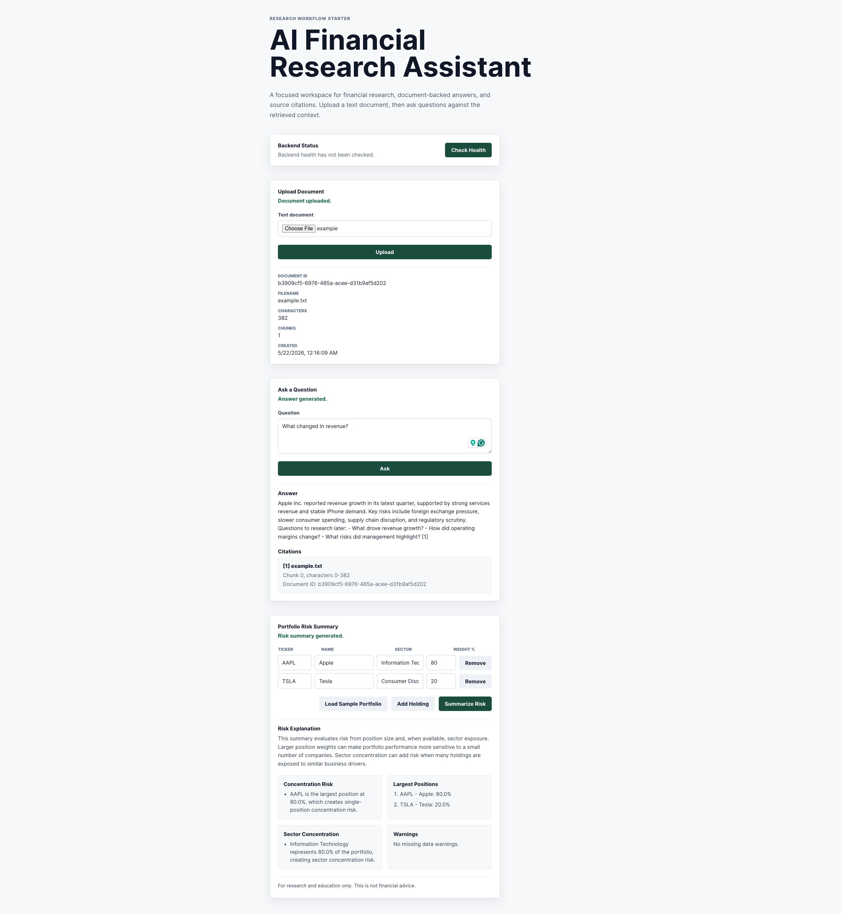
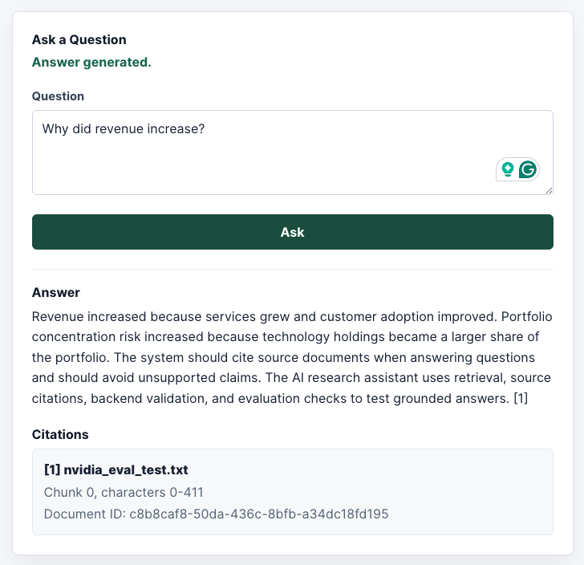
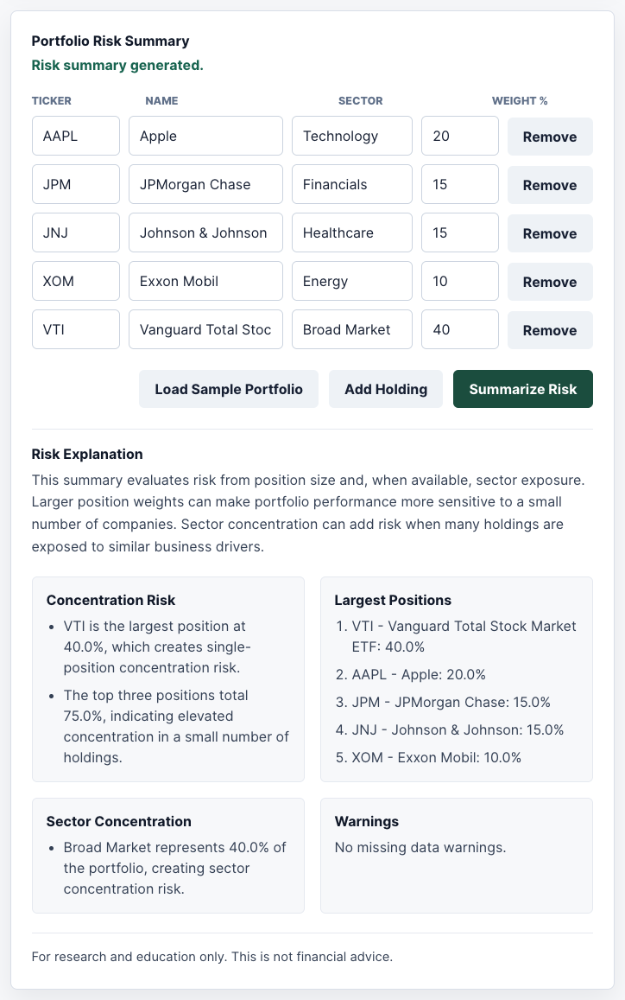
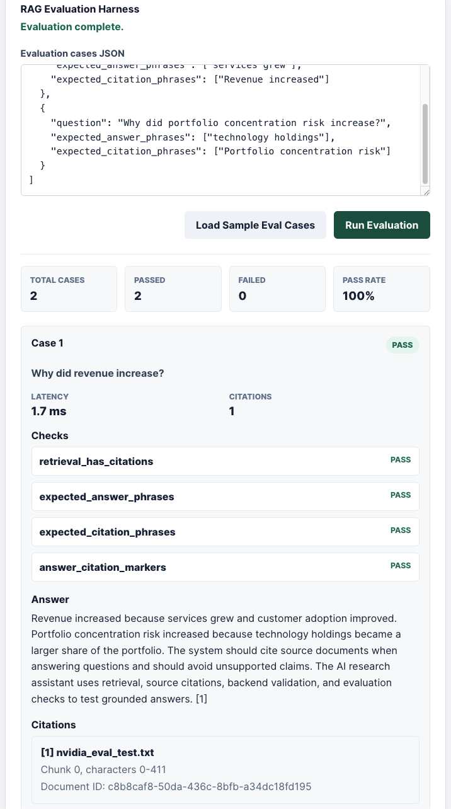
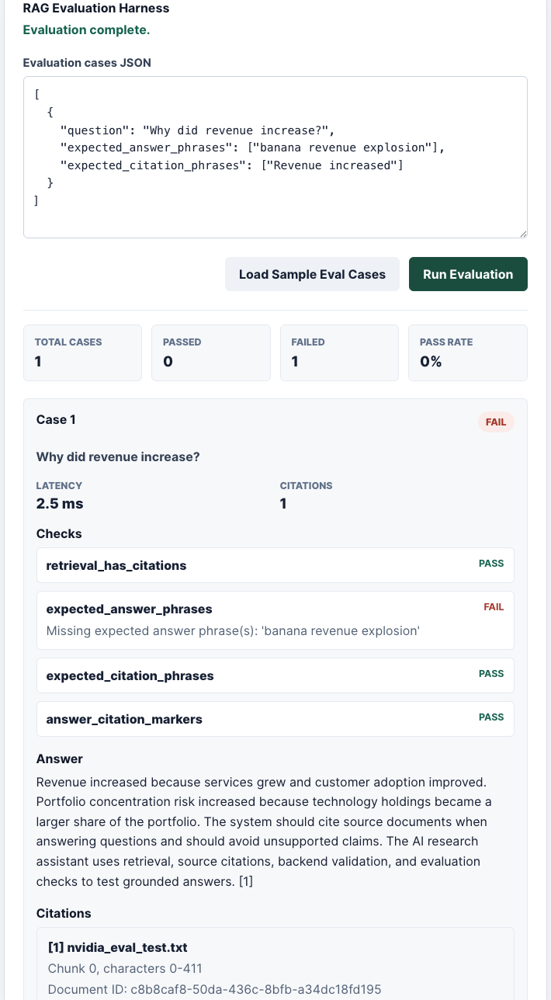

# AI Financial Research Assistant

A full-stack financial research assistant built with React, TypeScript, and FastAPI. It supports document upload, document-scoped RAG question answering with citations, a local RAG evaluation harness, and portfolio concentration-risk summaries from manually entered holdings.

The current RAG implementation is local and deterministic: it uses text chunking, hash-based embeddings, local retrieval, and a simple source-cited answer generator. It does not call OpenAI APIs or any LLM yet.

## Why I Built It

Financial research workflows often require jumping between filings, notes, portfolio spreadsheets, and ad hoc summaries. I built this project to show how a practical AI research tool can combine document-grounded answers, source citations, and simple portfolio risk analysis in one clean interface.

The goal is a portfolio-ready full-stack app: useful product behavior, clear architecture, local development ergonomics, and backend test coverage.

## Key Features

- Upload UTF-8 `.txt` research documents.
- Chunk documents and store source metadata locally.
- Ask questions against the currently uploaded document.
- Return concise answers with source citations and character ranges.
- Scope retrieval by `document_id` to avoid duplicate answers from repeated uploads.
- Run golden-question RAG evaluation cases with phrase checks, citation coverage, latency, and pass/fail metrics.
- Enter holdings manually or load a sample portfolio.
- Generate concentration-risk notes, largest positions, sector-risk notes, and missing-data warnings.
- Include a clear research/education disclaimer.

## Screenshots

### Full Workflow



### RAG Answer With Citations



### Portfolio Risk Summary



### RAG evaluation harness



### Evaluation failure detection



## Tech Stack

- Frontend: React, TypeScript, Vite
- Backend: Python, FastAPI, Pydantic
- Testing: pytest
- RAG prototype: local chunking, deterministic hash embeddings, JSON vector store
- Storage: local files under `backend/data/`

## Architecture Overview

```text
React UI
  -> FastAPI API
  -> document validation and storage
  -> text chunking
  -> local deterministic embeddings
  -> JSON vector store
  -> document-scoped retrieval
  -> source-cited answer
```

RAG evaluation uses the same local retrieval and answer path, then applies deterministic checks:

```text
React evaluation form
  -> FastAPI /research/evaluate
  -> RagService answer generation
  -> evaluation checks and latency metrics
  -> structured evaluation report
```

Portfolio risk summary is a separate rule-based flow:

```text
React holdings form
  -> FastAPI portfolio endpoint
  -> input validation
  -> concentration and sector analysis
  -> risk summary response
```

More detail: [docs/architecture.md](docs/architecture.md)

## Prerequisites

- Python 3.11+
- Node.js 20+
- npm

## Quick Start

Start the backend:

```bash
cd backend
python -m venv .venv
source .venv/bin/activate
pip install -r requirements.txt
.venv/bin/uvicorn app.main:app --reload
```

In a separate terminal, start the frontend:

```bash
cd frontend
npm install
npm run dev
```

The frontend runs at the URL printed by Vite, usually:

```text
http://localhost:5173
```

## Local Setup

### Backend

```bash
cd backend
python -m venv .venv
source .venv/bin/activate
pip install -r requirements.txt
cp .env.example .env
.venv/bin/uvicorn app.main:app --reload
```

Backend runs at:

```text
http://127.0.0.1:8000
```

### Frontend

```bash
cd frontend
npm install
cp .env.example .env
npm run dev
```

The frontend runs at the URL printed by Vite, usually:

```text
http://localhost:5173
```

## Environment Variables

Backend `.env`:

```bash
OPENAI_API_KEY=
DATABASE_URL=
```

These are placeholders for future integrations. The current app runs without OpenAI API calls.

Frontend `.env`:

```bash
VITE_API_BASE_URL=http://127.0.0.1:8000
```

Do not commit `.env` files or real API keys. See [docs/security.md](docs/security.md).

## API Endpoints

| Method | Endpoint | Purpose |
| --- | --- | --- |
| `GET` | `/health` | Backend health check |
| `POST` | `/documents/upload` | Upload a UTF-8 `.txt` document |
| `POST` | `/research/ask` | Ask a document-scoped RAG question |
| `POST` | `/research/evaluate` | Run golden-question RAG evaluation cases |
| `POST` | `/portfolio/risk-summary` | Generate a portfolio risk summary |

Example RAG request:

```bash
curl -X POST http://127.0.0.1:8000/research/ask \
  -H "Content-Type: application/json" \
  -d '{
    "document_id": "uuid-from-upload",
    "question": "What changed in revenue?",
    "top_k": 3
  }'
```

Example portfolio request:

```bash
curl -X POST http://127.0.0.1:8000/portfolio/risk-summary \
  -H "Content-Type: application/json" \
  -d '{
    "holdings": [
      {"ticker": "AAPL", "name": "Apple", "sector": "Technology", "weight_percent": 20},
      {"ticker": "JPM", "name": "JPMorgan Chase", "sector": "Financials", "weight_percent": 15},
      {"ticker": "JNJ", "name": "Johnson & Johnson", "sector": "Healthcare", "weight_percent": 15},
      {"ticker": "XOM", "name": "Exxon Mobil", "sector": "Energy", "weight_percent": 10},
      {"ticker": "VTI", "name": "Vanguard Total Stock Market ETF", "sector": "Broad Market", "weight_percent": 40}
    ]
  }'
```

Example RAG evaluation request:

```bash
curl -X POST http://127.0.0.1:8000/research/evaluate \
  -H "Content-Type: application/json" \
  -d '{
    "document_id": "uuid-from-upload",
    "top_k": 5,
    "cases": [
      {
        "question": "Why did revenue increase?",
        "expected_answer_phrases": ["online sales", "store traffic"],
        "expected_citation_phrases": ["Management attributed the increase"]
      }
    ]
  }'
```

Example RAG evaluation response:

```json
{
  "document_id": "uuid-from-upload",
  "total_cases": 1,
  "passed_cases": 1,
  "failed_cases": 0,
  "pass_rate": 1.0,
  "results": [
    {
      "question": "Why did revenue increase?",
      "answer": "Northstar Retail Group reported revenue... [1]",
      "passed": true,
      "latency_ms": 2.4,
      "citation_count": 1,
      "checks": [
        {
          "name": "retrieval_has_citations",
          "passed": true,
          "detail": null
        },
        {
          "name": "expected_answer_phrases",
          "passed": true,
          "detail": null
        },
        {
          "name": "expected_citation_phrases",
          "passed": true,
          "detail": null
        },
        {
          "name": "answer_citation_markers",
          "passed": true,
          "detail": null
        }
      ],
      "citations": [
        {
          "source_id": 1,
          "document_id": "uuid-from-upload",
          "filename": "example-financial-summary.txt",
          "chunk_index": 0,
          "start_char": 0,
          "end_char": 1000
        }
      ]
    }
  ]
}
```

## Evaluation Harness

The RAG evaluation harness is a deterministic local workflow inspired by NVIDIA NeMo Evaluator-style role stories for validating source-grounded RAG behavior. It does not call NVIDIA services, OpenAI APIs, or an LLM judge.

Each evaluation case defines a golden question plus:

- `expected_answer_phrases`: phrases that should appear in the generated answer.
- `expected_citation_phrases`: phrases that should appear in the retrieved cited context.

For each case, the harness records answer grounding checks, citation coverage, citation count, latency in milliseconds, pass/fail checks, failure details, and a structured report. This makes it useful for regression testing whether local retrieval and citation behavior still match known expectations after code changes.

More detail: [docs/evaluation.md](docs/evaluation.md)

## Example Workflow

1. Start the backend and frontend.
2. Open `http://localhost:5173`.
3. Check backend health.
4. Upload the sample document: [samples/example-financial-summary.txt](samples/example-financial-summary.txt).
5. Ask a question about the uploaded document.
6. Review the answer and citations.
7. Load sample evaluation cases or enter custom JSON cases.
8. Run the RAG evaluation harness and review pass/fail checks.
9. Load the sample portfolio or enter holdings manually.
10. Generate the portfolio risk summary.

## Testing Commands

Backend tests:

```bash
cd backend
.venv/bin/python -m pytest
```

Frontend build:

```bash
cd frontend
npm run lint
npm run build
```

## Limitations

- RAG uses deterministic local hash embeddings, not production semantic embeddings.
- Document ingestion currently supports UTF-8 `.txt` files only.
- The JSON vector store is intended for local development, not concurrent production use.
- Answer generation is intentionally simple and does not call an LLM yet.
- The evaluation harness uses deterministic phrase checks, not an LLM judge or production monitoring.
- Portfolio risk summary is rule-based and only uses user-entered holdings.
- The app does not connect to brokerage accounts, live market data, or real account data.
- Authentication, authorization, deployment hardening, and encrypted document storage are not included.

## Financial Disclaimer

This project is for research and education only. It is not financial advice and should not be used as the sole basis for investment, trading, tax, legal, or financial planning decisions.

## Resume Bullet

Built a full-stack AI financial research assistant using React, TypeScript, FastAPI, and a local RAG pipeline to upload research documents, answer document-scoped questions with source citations, and generate portfolio concentration-risk summaries.

Added a deterministic RAG evaluation harness with golden-question test cases, retrieval validation, answer-grounding checks, citation coverage checks, pass/fail metrics, latency measurements, and structured evaluation reports to detect regressions in source-grounded answer behavior.

Implemented typed FastAPI request/response models, backend validation, and automated tests for document ingestion, retrieval, source citation behavior, portfolio risk summaries, and evaluation workflows.